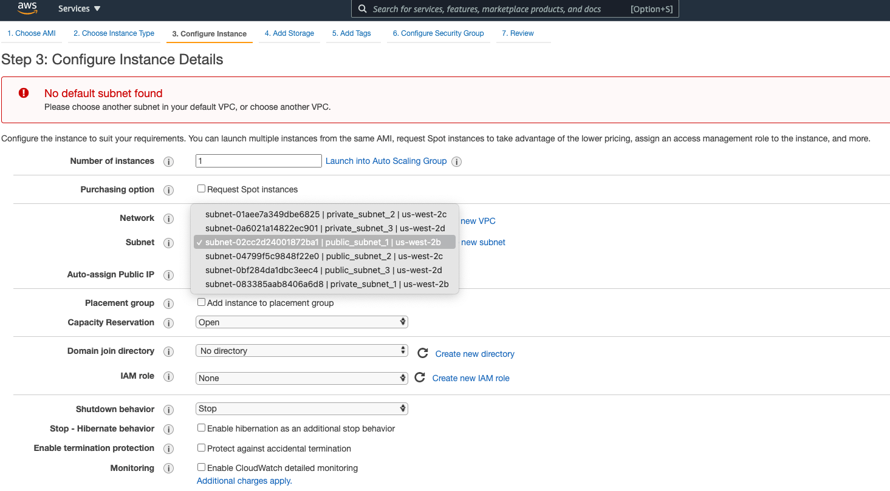
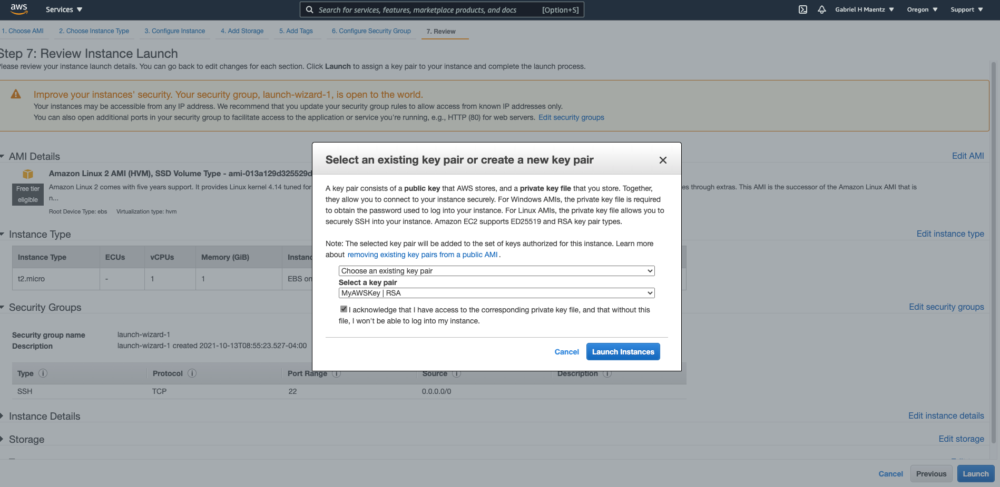

# Lab: Terraform Import

We've already seen many benefits of using Terraform to build out our cloud infrastructure. But what if there are existing resources that we'd also like to manage with Terraform?

Enter `terraform import`.

With minimal coding and effort, we can add our resources to our configuration and bring them into state.

- Task 1: Manually create EC2 (not with Terraform)
- Task 2: Prepare for a Terraform Import
- Task 3: Import the Resource in Terraform

## Task 1: Manually create EC2 (not with Terraform)

Log into AWS and in the EC2 console, select Instances from the left navigation panel in the VPC console. Click the Launch Instances button in the top right of the AWS console.


Choose a Amazon Linux 2 AMI


Choose `t3.micro` for the Instance Type which is Free Tier Eligible.

Select the appropriate VPC and Public Subnet



Launch the EC2 Instance with your `MyAWSKey` pair.



Note the instance id that AWS has assigned the EC2 Instance


Now our AWS infrastructure diagrams resembles the following were we have one web server created by Terraform in our environment and one web server that has been created manually in our environment (without Terraform)


The objective of the next task will be to import the manually created web server into our Terraform state and configuration so that all of our infrastructure can be managed via code.

## Task 2: Prepare for Import

In order to start the import, our `main.tf` requires a provider configuration. Start off with a provider block with a region in which you manually built the EC2 instance.

```hcl
provider "aws" {
  region = "us-west-2"
}
```

> Note: This is most likely already configured in your `main.tf` from previous labs.

You must also have a destination resource to store state against. Add an empty resource block now. We will add an EC2 instance called "aws_linux".

```hcl
resource "aws_instance" "aws_linux" {}
```

We're now all set to import our instance into state!

## Task 3: Import the Resource into Terraform

Using the instance ID provided by your instructor, run the `terraform import` command now. The import command is comprised of four parts.

Example:

- `terraform` to call our binary
- `import` to specify the action to take
- `aws_instance.aws_linux` to specify the resource in our config file (`main.tf`) that this resource corresponds to
- `i-0bfff5070c5fb87b6` to specify the real-world resource (in this case, an AWS EC2 instance) to import into state

> **Note**: The resource name and unique identifier of that resource are unique to each configuration.

See what happens below when we've successfully run `terraform import <resource.name> <unique_identifier>`.

The `<unique_identifier>` is the ID you captured at the end of Task 1.

```text
terraform import aws_instance.aws_linux i-0bfff5070c5fb87b6
aws_instance.linux: Importing from ID "i-0bfff5070c5fb87b6 "...
aws_instance.linux: Import prepared!
  Prepared aws_instance for import
aws_instance.linux: Refreshing state... [id=i-0bfff5070c5fb87b6]

Import successful!

The resources that were imported are shown above. These resources are now in
your Terraform state and will henceforth be managed by Terraform.
```

Great!
Our resource now exists in our state.
But what happens if we were to run a plan against our current config?

```bash
terraform plan

  Error: Missing required argument

    on main.tf line 5, in resource "aws_instance" "linux":
     5: resource "aws_instance" "linux" {

  The argument "ami" is required, but no definition was found.


  Error: Missing required argument

    on main.tf line 5, in resource "aws_instance" "linux":
     5: resource "aws_instance" "linux" {

  The argument "instance_type" is required, but no definition was found.
```

We're missing some required attributes.
How can we find those without looking at the console?
Think back to our work with the workspace state.
What commands will show us the information we need?

We know the exact resource to look for in our state, so let's query it using the `terraform state show` command.

```bash
terraform state show aws_instance.aws_linux
# aws_instance.aws_linux:
resource "aws_instance" "aws_linux" {
    ami                                  = "ami-013a129d325529d4d"
    arn                                  = "arn:aws:ec2:us-west-2:508140242758:instance/i-0bfff5070c5fb87b6"
...
```

Using the output from the above command, we can now piece together the minimum required attributes for our configuration.
Add the required attributes to your resource block and rerun the apply.

```hcl
resource "aws_instance" "aws_linux" {
  ami           = "ami-013a129d325529d4d"
  instance_type = "t3.micro"
}
```

Your `ami` and `instance_type` may differ. Be sure to use the values provided in the previous step.

```text
terraform plan
...
 # aws_instance.aws_linux will be updated in-place
  ~ resource "aws_instance" "aws_linux" {
        id                                   = "i-0bfff5070c5fb87b6"
        tags                                 = {}
      ~ tags_all                             = {
          + "Owner"      = "Acme"
          + "Provisoned" = "Terraform"
        }
        # (27 unchanged attributes hidden)
        # (6 unchanged blocks hidden)
    }
```

You've successfully imported **and** declared your existing resource into your Terraform configuration. Notice that Terraform wants to update the default tags for this instance based on the default tags we specified in the [Terraform AWS Provider - Default Tags](./labs/3c-Terraform%20AWS%20Provider%20-%20Default%20Tags.md) lab.

To apply these default tags you can run a `terraform apply`

```bash
terraform apply
```

This verifies that you can now modify, update, or destroy this EC2 server using the traditional Terraform configuration and CLI commands now that it has been imported into Terraform.

You can now remove the item from your configuration as this server will no longer be required for future labs.
