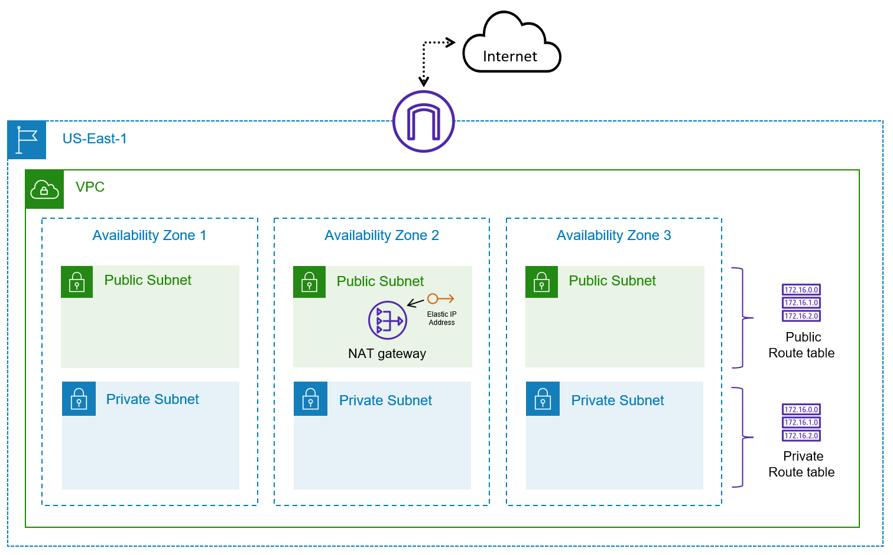

# Terraform Modules

Terraform configuration can be separated out into modules to better organize your configuration. This makes your code easier to read and reusable across your organization. A Terraform module is very simple: any set of Terraform configuration files in a folder is a module. Modules are the key ingredient to writing reusable and maintainable Terraform code. Complex configurations, team projects, and multi-repository codebases will benefit from modules. Get into the habit of using them wherever it makes sense.

- Task 1: Create a local Terraform module
- Task 2: Reference a module within Terraform Configuration
- Task 3: Terraform module reuse

## Task 1: Create a local Terraform Module

A Terraform module is just a set of Terraform configuration files. Modules are just Terraform configurations inside a folder - there's nothing special about them. In fact, the code you’ve been writing so far is a module: the root module. For this lab, we'll create a local module for a new server configuration.

### Step 1.1

Create a new directory called `server` in your `/workspace/terraform` directory and create a new file inside of it called `server.tf`.

### Step 1.2

Edit the file `server/server.tf`, with the following contents:

```hcl
variable "ami" {}
variable "size" {
  default = "t3.micro"
}
variable "subnet_id" {}
variable "security_groups" {
  type = list(any)
}
resource "aws_instance" "web" {
  ami                    = var.ami
  instance_type          = var.size
  subnet_id              = var.subnet_id
  vpc_security_group_ids = var.security_groups

  tags = {
    "Name"        = "Server from Module"
    "Environment" = "Training"
  }
}

output "public_ip" {
  value = aws_instance.web.public_ip
}

output "public_dns" {
  value = aws_instance.web.public_dns
}
```

### Step 1.3

In your root configuration (also called your root module) `/workspace/terraform/main.tf`, we can call our new `server` module with a Terraform module block. Remember that terraform only works with the configuration files that are in it's current working directory. Modules allow us to reference Terraform configuration that lives outside of our working directory. In this case we will incorporate all configuration that is both inside our working directory (root module) and inside the `server` directory (child module).

```hcl
module "server" {
  source          = "./server"
  ami             = data.aws_ami.ubuntu.id
  subnet_id       = aws_subnet.public_subnets["public_subnet_3"].id
  security_groups = [
    aws_security_group.vpc-ping.id,
    aws_security_group.ingress-ssh.id,
    aws_security_group.vpc-web.id
  ]
}
```

### Step 1.4 Install and Apply Module

Now run `terraform init` to install the module. Terraform configuration files located within modules are pulled down by Terraform during initialization, so any time you add or update a module version you must run a `terraform init`.

```shell
terraform init
```

You can see that our configuaration now depends on this module to be installed and used by using the `terraform providers` command.

```shell
terraform providers

Providers required by configuration:
.
|-- provider[registry.terraform.io/hashicorp/aws] ~> 3.0
|-- provider[registry.terraform.io/hashicorp/http] 2.1.0
|-- provider[registry.terraform.io/hashicorp/random] 3.1.0
|-- provider[registry.terraform.io/hashicorp/local] 2.1.0
|-- provider[registry.terraform.io/hashicorp/tls] 3.1.0
|-- module.server
    |-- provider[registry.terraform.io/hashicorp/aws]

Providers required by state:

    provider[registry.terraform.io/hashicorp/aws]

    provider[registry.terraform.io/hashicorp/local]

    provider[registry.terraform.io/hashicorp/random]

    provider[registry.terraform.io/hashicorp/tls]
```

Run `terraform apply` to create a new server using the `server` module. It may take a few minutes for the server to be built using the module.

```
Do you want to perform these actions?
  Terraform will perform the actions described above.
  Only 'yes' will be accepted to approve.

  Enter a value: yes

module.server.aws_instance.web: Creating...
module.server.aws_instance.web: Still creating... [10s elapsed]
```

## Task 2: Reference a Module within Terraform Configuration

When used, Terraform modules will be listed within Terraform's state file and can be referenced using their module name.

```shell
terraform state list

# Resource defined in root module/working directory
aws_instance.web_server

# Resource defined in `server` module
module.server.aws_instance.web
```

We can look at all the details of the server created using our `server` module.

```shell
terraform show module.server.aws_instance.web
```

We can add two output blocks to our `main.tf` to report back the IP and DNS information from our `server` module. Notice how Terraform references (interpolation syntax) information about the server build from a module.

```hcl
output "public_ip" {
  value = module.server.public_ip
}

output "public_dns" {
  value = module.server.public_dns
}
```

## Task 3: Reuse the module to build a server in a different subnet

One of the benefits of Terraform modules is that they can easily be reused across your organization. Let's use our local module again to build out another server in a seperate subnet.



```hcl
module "server_subnet_1" {
  source          = "./server"
  ami             = data.aws_ami.ubuntu.id
  subnet_id       = aws_subnet.public_subnets["public_subnet_1"].id
  security_groups = [
    aws_security_group.vpc-ping.id,
    aws_security_group.ingress-ssh.id,
    aws_security_group.vpc-web.id
  ]
}
```

Run `terraform apply` to create a new server using the `server` module. It may take a few minutes for the server to be built using the module.

```
Do you want to perform these actions?
  Terraform will perform the actions described above.
  Only 'yes' will be accepted to approve.

  Enter a value: yes

module.server_subnet_1.aws_instance.web: Creating...
module.server_subnet_1.aws_instance.web: Still creating... [10s elapsed]
```

You

```hcl
output "public_ip_server_subnet_1" {
  value = module.server_subnet_1.public_ip
}

output "public_dns_server_subnet_1" {
  value = module.server_subnet_1.public_dns
}
```
