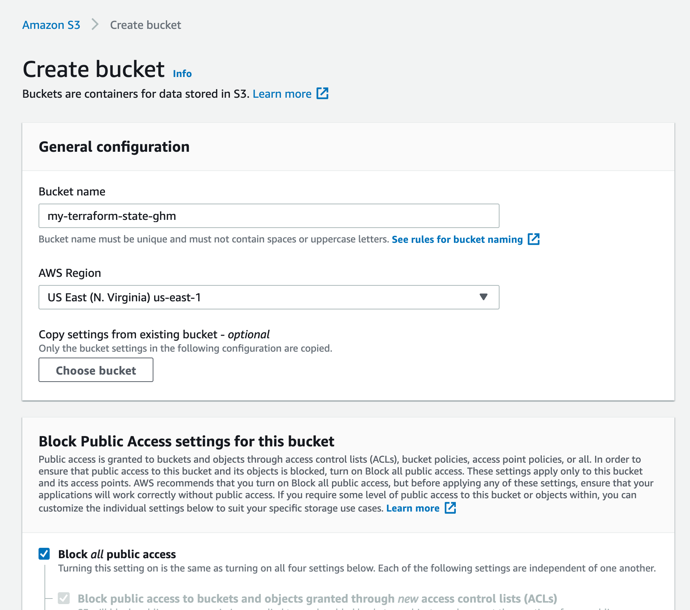
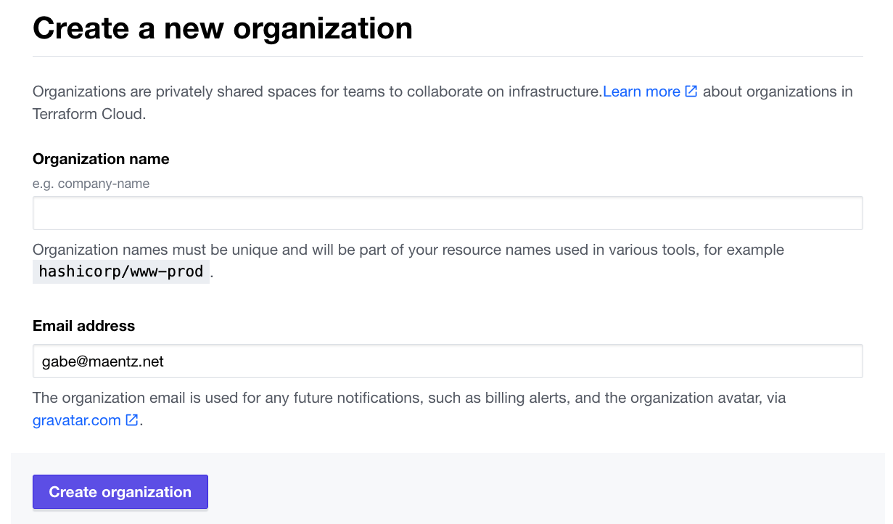
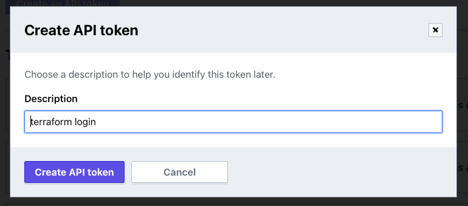
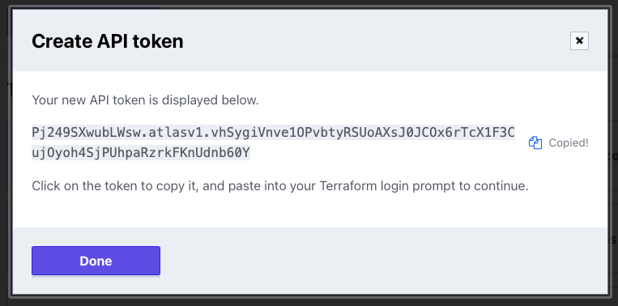

# Lab: Terraform State Backend Authentication

The `local` backend stores state as a local file on disk, but other backend types store state in a remote service of some kind, which allows multiple people to access it. Accessing state in a remote service generally requires some kind of access credentials since state data contains extremely sensitive information. It is important to strictly control who can access your Terraform backend.

We will look at two different backend types compatible with Terraform and how each handles authentication.

- Task 1: Authentication: S3 Standard Backend
- Task 2: Authentication: Remote Enhanced Backend

# Backend Configuration: Authentication

Some backends allow us to provide access credentials directly as part of the configuration. However, in normal use we do not recommend including access credentials as part of the backend configuration. Instead, leave those arguments completely unset and provide credentials via the credentials files or environment variables that are conventional for the target system, as described in the documentation for each backend.

# Task 1: Authentication: S3 Standard Backend

The terraform backend end configuration for a given working directory is specified in the Terraform configuration block. Our terraform configuration block for this lab is located in the `terraform.tf` file.

The `s3` backend stores Terraform state as a given key in a given bucket on Amazon S3. This backend supports several different methods in which the Terraform CLI can authenticate to the Amazon S3 bucket.

### Step 1.1 - Create the bucket in AWS

Create a new bucket within AWS to centrally store your terraform state files:



If you’re using S3 as a backend, you’ll want to configure an IAM policy that solely grants access to the S3 bucket for production to a small handful of trusted people or perhaps solely just the CI server you use to deploy to your environments.

### Step 1.2 - Remove existing resources with `terraform destroy`

If you already have a state file present with infrastructure deployed from previous labs we will first issue a cleanup of our infrastructure using a `terraform destroy` before changing our our backend. This is not a requirement as Terraform supports the migration of state data between backends, which will be covered in a future lab.

```shell
terraform destroy

Do you really want to destroy all resources?
  Terraform will destroy all your managed infrastructure, as shown above.
  There is no undo. Only 'yes' will be accepted to confirm.

  Enter a value: yes
```

### Step 1.2 - Update Terraform Configuration to use `s3` backend

Update the `terraform.tf` configuration to utilize the `s3` backend with the required arguments.

```hcl
terraform {
  backend "s3" {
    bucket = "myterraformstate"
    key    = "path/to/my/key"
    region = "us-west-2"
  }
}
```

Example:

```hcl
terraform {
  backend "s3" {
    bucket = "my-terraform-state-ghm"
    key    = "prod/aws_infra"
    region = "us-west-2"
  }
}
```

> Note: A Terraform configuration can only specify a single backend. If a backend is already configured be sure to replace it. Copy just the `backend` block above and not the full `terraform block` You can validate the syntax is correct by issuing a `terraform validate`

### Step 1.3 - Provide Terraform AWS credentials to connect to S3 Bucket

Providing credentials fo accessing state in an S3 bucket can be done in a number of different ways. This lab will showcase using environment variables but a shared credentials file can also be used. It is important to protect any credential information so while it is possible to set these values in the code itself it is strongly not recommended.

Source credentials to the S3 backend using the `AWS_ACCESS_KEY_ID` and `AWS_SECRET_ACCESS_KEY` environment variables.

```shell
export AWS_ACCESS_KEY_ID="YOUR_AWS_ACCESS_KEY_ID"
export AWS_SECRET_ACCESS_KEY="YOUR_AWS_SECRET_ACCESS_KEY"
```

(Optional): If using Multi-Factor Authentication you can source the token using the `AWS_SESSION_TOKEN` environment variable.

(Optional): In lieu of setting environment varialbes you can also utilize an AWS shared credentials file by specifying the path to the file useing the `shared_credentials_file` arguement within the backend configuration block. This defaults to ~/.aws/credentials.

### Step 1.4 - Verify Authentication to S3 Backend

Once the configuration is complete, you can verify authentication to the S3 backend by first removing infrastructure that has already been deployed with a `terraform destroy` and performing a `terraform init`

```
terraform init

Initializing the backend...

Successfully configured the backend "s3"! Terraform will automatically
use this backend unless the backend configuration changes.
```

### Step 1.5 - Write Terraform State to S3 Backend

Now that autentication has been verified, we can build out the infrastructure with our S3 backend for storing state we can issue a `terraform apply`

```shell
terraform apply

...

Do you want to perform these actions?
  Terraform will perform the actions described above.
  Only 'yes' will be accepted to approve.

  Enter a value: yes
```


Now the state file for your infrastructure build out is stored remotely on the S3 object store in your bucket. This can now be utilized by others who have appropriate permissions to the S3 bucket as we have succesfully centralized the terraform state file.

### Step 1.6 - Remove Terraform AWS credentials to connect to S3 Bucket

If you would like to remove access to a centralized state file, you can modify the credentials to your S3 bucket. To showcase unauthenticated access, let's change the source credentials to the S3 backend by incorrectly setting the `AWS_ACCESS_KEY_ID` and `AWS_SECRET_ACCESS_KEY` environment variables.

```shell
export AWS_ACCESS_KEY_ID="notvalid"
export AWS_SECRET_ACCESS_KEY="notvalid"
```

```shell
terraform state list

Error: error configuring S3 Backend: error validating provider credentials: error calling sts:GetCallerIdentity: InvalidClientTokenId: The security token included in the request is invalid
status code: 403, request id: 00771614-5553-4eaf-ae8d-a3ce54c66060
```

Once we change these back, you can see we again have access.

```shell
export AWS_ACCESS_KEY_ID="YOUR_AWS_ACCESS_KEY_ID"
export AWS_SECRET_ACCESS_KEY="YOUR_AWS_SECRET_ACCESS_KEY"
```

```shell
terraform state list
```

# Task 2: Authentication: Remote Enhanced Backend

The Terraform `remote` backend stores Terraform state and may be used to run operations in Terraform Cloud. This backend supports the ability to store Terraform state information and perform operations all within Terraform Cloud, based on privelaged access.

### Step 2.1

For this task you will have to [sign up](https://app.terraform.io/signup/account) for a Terraform Cloud account. In order to store state remotely on Terraform Cloud using the `remote` backend we need to create a user token and configure our local environment to utilize that token. We will leverage the `terraform login` command to obtain and save an API token for authenticating to Terraform Cloud.

### Step 2.2

**Note:** You can skip this step if you've already created a organization.

[Log in](https://app.terraform.io) to Terraform Cloud and go to the new organization page:

- New users are automatically taken to the new organization page.
- If your user account is already a member of an organization, open the organization switcher menu in the top navigation bar and click the "Create new organization" button.

Enter a unique organization name and an email address for notifications, then click the "Create organization" button.



### Step 2.3

Terraform's CLI needs credentials before it can access Terraform Cloud. We will leverage the `terraform login` command to perform our login to TFC.

```bash
terraform login

Terraform will request an API token for app.terraform.io using your browser.

If login is successful, Terraform will store the token in plain text in
the following file for use by subsequent commands:
    /Users/varoon/.terraform.d/credentials.tfrc.json

Do you want to proceed?
  Only 'yes' will be accepted to confirm.

  Enter a value: yes


---------------------------------------------------------------------------------

Open the following URL to access the tokens page for app.terraform.io:
    https://app.terraform.io/app/settings/tokens?source=terraform-login


---------------------------------------------------------------------------------

Generate a token using your browser, and copy-paste it into this prompt.

Terraform will store the token in plain text in the following file
for use by subsequent commands:
    /home/nyl/.terraform.d/credentials.tfrc.json

Token for app.terraform.io:
  Enter a value:


Retrieved token for user varoon_sahgal


---------------------------------------------------------------------------------

Success! Terraform has obtained and saved an API token.

The new API token will be used for any future Terraform command that must make
authenticated requests to app.terraform.io.

```



Generate a token using your browser, and copy-paste it into this prompt.



```shell
Token for app.terraform.io:
  Enter a value:


Retrieved token for user varoon_sahgal


---------------------------------------------------------------------------------

                                          -
                                          -----                           -
                                          ---------                      --
                                          ---------  -                -----
                                           ---------  ------        -------
                                             -------  ---------  ----------
                                                ----  ---------- ----------
                                                  --  ---------- ----------
   Welcome to Terraform Cloud!                     -  ---------- -------
                                                      ---  ----- ---
   Documentation: terraform.io/docs/cloud             --------   -
                                                      ----------
                                                      ----------
                                                       ---------
                                                           -----
                                                               -


   New to TFC? Follow these steps to instantly apply an example configuration:

   $ git clone https://github.com/hashicorp/tfc-getting-started.git
   $ cd tfc-getting-started
   $ scripts/setup.sh
```

We will leverage this `remote` backend authentication to interact with Terraform Cloud from the CLI of our working directory in future labs.
