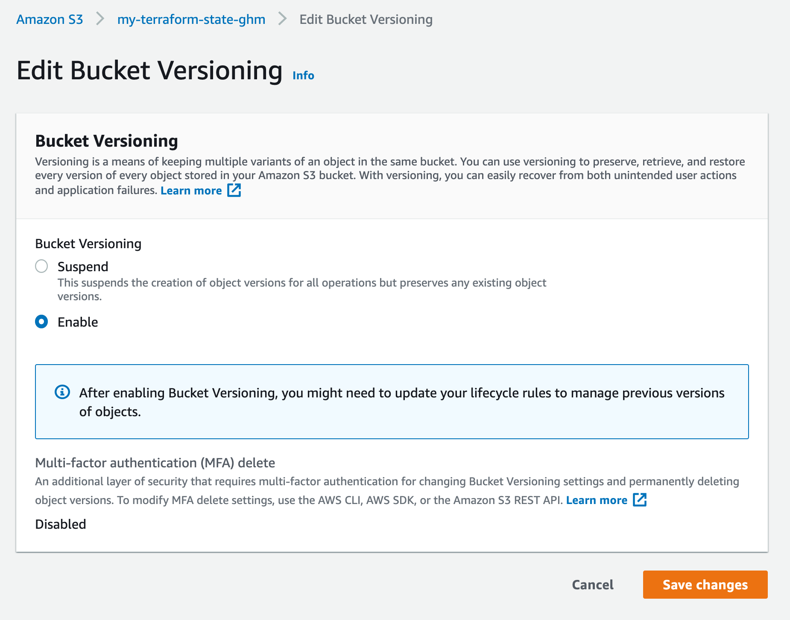
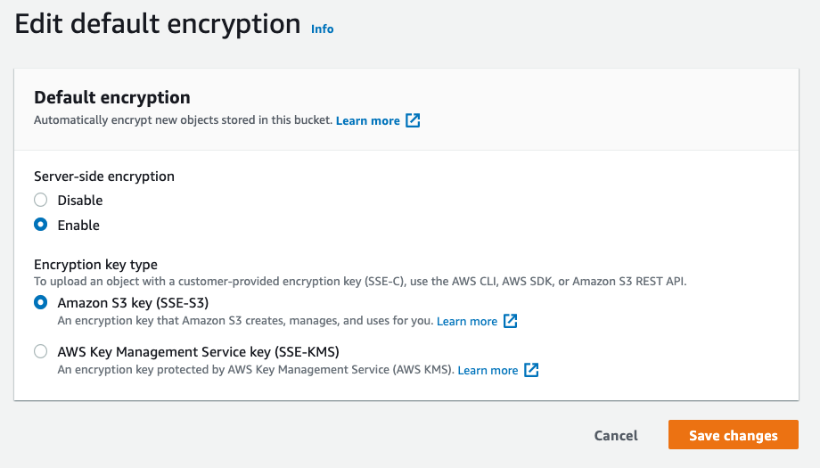
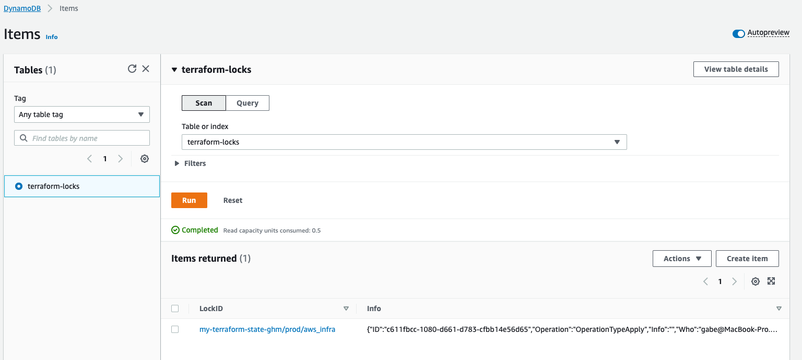

# Lab: Terraform State Backend Storage

In order to properly and correctly manage your infrastructure resources, Terraform stores the state of your managed infrastructure. Each Terraform configuration can specify a backend which defines exactly where and how operations are performed. Most backends support security and collaboration features so using a backend is a must-have both from a security and teamwork perspective.

Terraform has a built-in selection of backends, and the configured backend must be available in the version of Terraform you are using. In this lab we will explore the use of some common Terraform standard and enhanced backends.

- Task 1: Standard Backend: S3
- Task 2: Standard Backend: HTTP Backend (Optional)

## Standard Backends

The built in Terraform standard backends store state remotely and perform terraform operations locally via the command line interface. Popular standard backends include:

- [AWS S3 Backend (with DynamoDB)](https://www.terraform.io/docs/language/settings/backends/s3.html)
- [Google Cloud Storage Backend](https://www.terraform.io/docs/language/settings/backends/gcs.html)
- [Azure Storage Backend](https://www.terraform.io/docs/language/settings/backends/azurerm.html)

Consult Terraform documentaion for a [full list of Terraform standard backends](https://www.terraform.io/docs/language/settings/backends/index.html)

Most backends also support collaboration features so using a backend is a must-have both from a security and teamwork perspective. Not all of these features need to be configured and enabled, but we will walk you some of the most beneficial items including versioning, encryption and state locking.

## Task 1: Standard Backend: S3

### Step 1.1 - Create S3 Bucket and validate Terraform Configuration

In the previous lab we created an S3 bucket to centralize our terraform state to a remote S3 bucket. If you have not performed these steps please step through them as outlined in the previous lab. If you have already performed these steps you can move to the next step of the lab.

### Step 1.2 - Validate State on S3 Backend

We will want to validate that we can authenticate to our terraform backend and list the information in the state file. Let's validate that our configuration is pointing to the correct bucket and path.

`terraform.tf`

```hcl
terraform {
  backend "s3" {
    bucket = "myterraformstate"
    key    = "path/to/my/key"
    region = "us-west-2"
  }
}
```

```shell
terraform state list
```

### Step 1.3 - Enable Versioning on S3 Bucket

Enabling versioning on our terraform backend is important as it allows us to restore the previous version of state should we need to. The `s3` backend supports versioning, so every revision of your state file is stored.



Once versioning is enabled on your bucket let's make a configuration change that will result in a state change and execute that change with a `terraform apply`.

Update the size of your web server from `t3.micro` to a `t2.small` and apply the change.

```hcl
resource "aws_instance" "web_server_2" {
  ami           = data.aws_ami.ubuntu.id
  instance_type = "t2.small"
  subnet_id     = aws_subnet.public_subnets["public_subnet_2"].id
  tags = {
    Name = "Web EC2 Server 2"
  }
}
```

```bash
terraform apply
```

Now you can see that your state file has been updated and if you check `Show Versions` on the bucket you will see the different versions of your state file.


### Step 1.4 - Enable Encryption on S3 Bucket

It is also incredibly important to protect terraform state data as it can contain extremely sensitive information. Store Terraform state in a backend that supports encryption. Instead of storing your state in a local terraform.tfstate file. Many backends support encryption, so that instead of your state files being in plain text, they will always be encrypted, both in transit (e.g., via TLS) and on disk (e.g., via AES-256). The `s3` backend supports encryption, which reduces worries about storing sensitive data in state files.



Anyone on your team who has access to that S3 bucket will be able to see the state files in an unencrypted form, so this is still a partial solution, but at least the data will be encrypted at rest (S3 supports server-side encryption using AES-256) and in transit (Terraform uses SSL to read and write data in S3).

### Step 1.4 - Enable Locking for S3 Backend

The `s3` backend stores Terraform state as a given key in a given bucket on Amazon S3 to allow everyone working with a given collection of infrastructure the ability to access the same state data. In order to prevent concurrent modifications which could cause corruption, we need to implement locking on the backend. The `s3` backend supports state locking and consistency checking via Dynamo DB.

State locking for the `s3` backend can be enabled by setting the dynamodb_table field to an existing DynamoDB table name. A single DynamoDB table can be used to lock multiple remote state files.

Create a DynamoDB table


Update the `s3` backend to use the new DynamoDB Table and reconfigure your backend.

```hcl
terraform {
  backend "s3" {
    # Replace this with your bucket name!
    bucket = "myterraformstate"
    key    = "path/to/my/key"
    region = "us-west-2"

    # Replace this with your DynamoDB table name!
    dynamodb_table = "terraform-locks"
    encrypt        = true
  }
}
```

```shell
terraform init -reconfigure

Initializing the backend...

Successfully configured the backend "s3"! Terraform will automatically
use this backend unless the backend configuration changes.
```

Update the size of your web server from `t2.small` to a `t3.micro` and apply the change.

```hcl
resource "aws_instance" "web_server_2" {
  ami           = data.aws_ami.ubuntu.id
  instance_type = "t3.micro"
  subnet_id     = aws_subnet.public_subnets["public_subnet_2"].id
  tags = {
    Name = "Web EC2 Server 2"
  }
}
```

```bash
terraform apply
```

Now you can see that your state file is locked by selecting the DynamoDB table and looking at `View Items` to see the lock.



### Step 1.4 - Remove existing resources with `terraform destroy`

Before exploring other types of state backends we will issue a cleanup of our infrastructure using a `terraform destroy` before changing our our backend in the next steps. This is not a requirement as Terraform supports the migration of state data between backends, which will be covered in a future lab.

```shell
terraform destroy

Plan: 0 to add, 0 to change, 27 to destroy.

Do you really want to destroy all resources?
  Terraform will destroy all your managed infrastructure, as shown above.
  There is no undo. Only 'yes' will be accepted to confirm.

  Enter a value: yes
```

> Note: You delete any instances of the `terraform.tfstate` or `terraform.tfstate.backup` items locally as your state is now being managed remotely. Although not required with standard backends it is helpful to keep your working directory clean.

## Task 2: Standard Backend: HTTP Backend (Optional)

Let's take a look at a different standard Terraform backend type - `http`. A configuration can only provide one backend block, so let's update our configuration to utilize the `http` backend instead of `s3`.

To use this backend we will first need to provide an simple HTTP Server for which Terraform can store it's state. This lab is optional because not all students will be able to launch or have access to a HTTP server. This lab will use a simple Simple HTTP server that is being executed via python. The [source code](https://github.com/mikalstill/junkcode/tree/master/terraform/remote_state) of this HTTP server is available for use.

### Step 2.1 - Initiate HTTP Server

Copy the HTTP Server [code](https://github.com/mikalstill/junkcode/tree/master/terraform/remote_state) to a new directory (for example: `webserver`) and after following the instructions start the web server using the following command in a terminal:

```shell
cd webserver
python -m SimpleHTTPServer 8000
```

```shell
 * Serving Flask app 'stateserver' (lazy loading)
 * Environment: production
   WARNING: This is a development server. Do not use it in a production deployment.
   Use a production WSGI server instead.
 * Debug mode: on
 * Running on all addresses.
   WARNING: This is a development server. Do not use it in a production deployment.
 * Running on http://192.168.1.202:5000/ (Press CTRL+C to quit)
 * Restarting with stat
 * Debugger is active!
 * Debugger PIN: 158-806-515
```

### Step 2.2 - Update Terraform configuration to use HTTP Standard Backend

Update your Terraform configuration block to use the `http` backend pointing to the webserver that was just launched.

`terraform.tf`

```hcl
terraform {
  backend "http" {
    address        = "http://localhost:5000/terraform_state/my_state"
    lock_address   = "http://localhost:5000/terraform_lock/my_state"
    lock_method    = "PUT"
    unlock_address = "http://localhost:5000/terraform_lock/my_state"
    unlock_method  = "DELETE"
  }
}
```

> Note: A Terraform configuration can only specify a single backend. If a backend is already configured be sure to replace it. Copy just the backend block above and not the full terraform block You can validate the syntax is correct by issuing a `terraform validate`

### Step 2.3 - Re-initialize Terraform and Validate HTTP Backend

```shell
terraform init -reconfigure
```

```shell
Initializing the backend...

Successfully configured the backend "http"! Terraform will automatically
use this backend unless the backend configuration changes.
```

```shell
terraform apply

Plan: 27 to add, 0 to change, 0 to destroy.

Do you want to perform these actions?
  Terraform will perform the actions described above.
  Only 'yes' will be accepted to approve.

  Enter a value: yes

...

Apply complete! Resources: 27 added, 0 changed, 0 destroyed.
```

View the HTTP Logs in the webserver terminal to showcase the use of the `http` backend

```
127.0.0.1 - - [] "GET /terraform_state/my_state HTTP/1.1" 404 -
[,636] DEBUG in stateserver: PUT for http://localhost:5000/terraform_lock/my_state...
    Header -- Host = localhost:5000
    Header -- User-Agent = Go-http-client/1.1
    Header -- Content-Length = 199
    Header -- Content-Md5 = RlUK/ZscZNV/YNHQw0gyNw==
    Header -- Content-Type = application/json
    Header -- Accept-Encoding = gzip
    Body -- {"ID":"12cae7fb-5f47-d751-8d8d-00ac15b25a00","Operation":"OperationTypeApply","Info":"","Who":"varoon@MacBook-Pro,"Version":"1.0.10","Created":"06:47.629496Z","Path":""}

127.0.0.1 - - [] "POST /terraform_state/my_state?ID=12cae7fb-5f47-d751-8d8d-00ac15b25a00 HTTP/1.1" 200 -
[,998] DEBUG in stateserver: DELETE for http://localhost:5000/terraform_lock/my_state...
    Header -- Host = localhost:5000
    Header -- User-Agent = Go-http-client/1.1
    Header -- Content-Length = 199
    Header -- Content-Md5 = RlUK/ZscZNV/YNHQw0gyNw==
    Header -- Content-Type = application/json
    Header -- Accept-Encoding = gzip
    Body -- {"ID":"12cae7fb-5f47-d751-8d8d-00ac15b25a00","Operation":"OperationTypeApply","Info":"","Who":"varoon@MacBook-Pro","Version":"1.0.10","Created":"06:47.629496Z","Path":""}
```

### Step 2.4 - View the state, log and lock files.

You can view the remote state file in the `http` backend by going into the webserver directory and looking inside the `.stateserver` directory. Both the state file and the log are located in this directory. This backend also supports state locking creating a `my_state.lock` when a lock is applied.

```shell
webserver

|-- .stateserver
|   |- my_state
|   |- my_state.log
|-- requirements.txt
|-- stateserver.py
```

### Step 2.5 - Remove existing resources with `terraform destroy`

Before exploring other backends we will issue a cleanup of our infrastructure using a `terraform destroy` before changing our our backend in the next steps. This is not a requirement as Terraform supports the migration of state data between backends, which will be covered in a future lab.

```shell
terraform destroy

Plan: 0 to add, 0 to change, 27 to destroy.

Do you really want to destroy all resources?
  Terraform will destroy all your managed infrastructure, as shown above.
  There is no undo. Only 'yes' will be accepted to confirm.

  Enter a value: yes
```

> Note: You delete any instances of the `terraform.tfstate` or `terraform.tfstate.backup` items locally as your state is now being managed remotely. Although not required with standard backends it is helpful to keep your working directory clean.

### Step 2.6 - Stop Web Server

Once all the cloud resources have been cleaned up you can stop the HTTP Server in the `webserver` directory.
